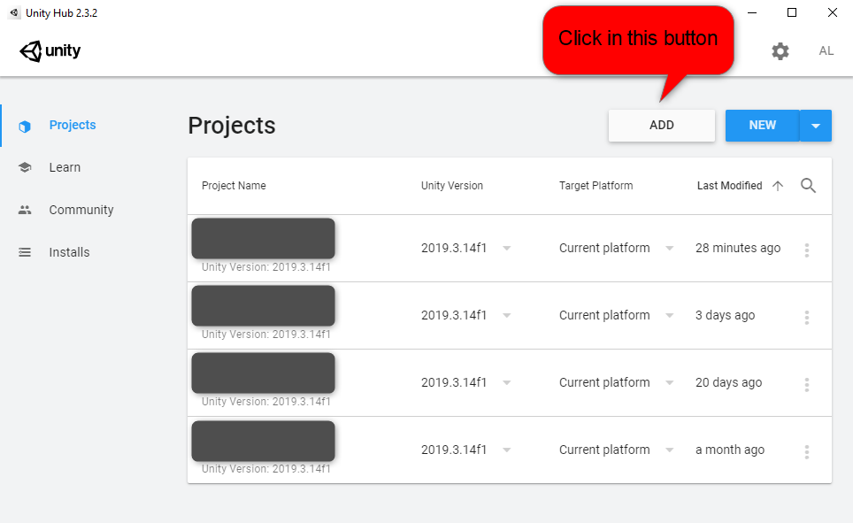
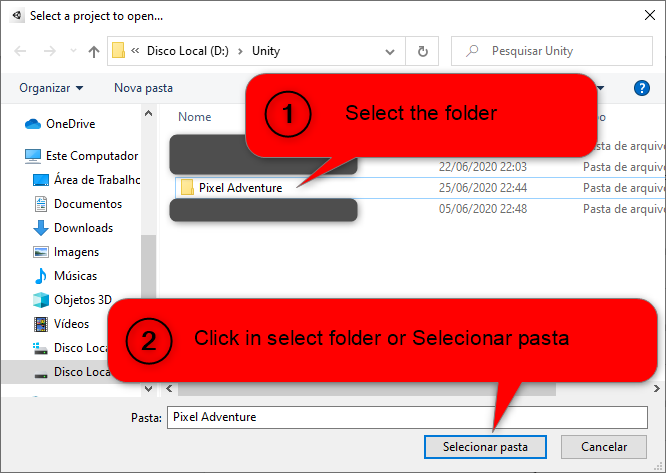
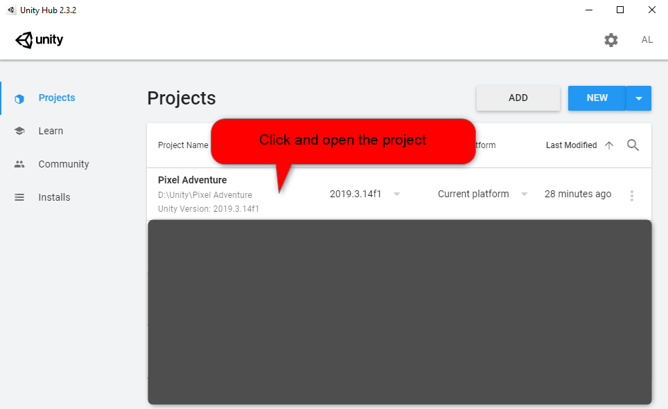

# Pixel Adventure
Unity Game from DM117

## How to Download and Execute/Modify

Clone repository

```bash
git clone git@github.com:AndreOneti/Pixel-Adventure.git
```

#### Open UnitHub and add project.



#### Select folder Pixel Adventure.



#### Click in projet imported to open.



#### Selecte first scene an run the game.


<hr>

## Game Resolution

>The game runs at 1920x1080 resolution.
>
>if the resolution is different, the game will present visual bugs.

<hr>

## Game controller

- To move Player use keyboard arrows (Left and Right).
- To Jump use SpaceBar.
- To interact with buttons use left mouse click.